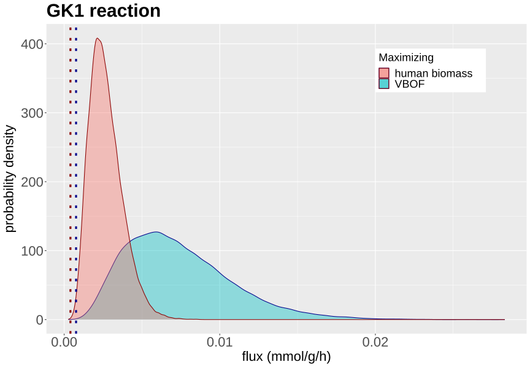

Our Python library for flux sampling, using our [Multiphase Monte Carlo Sampling algorithm](../publications/2023-08-18-jocg.md) is now published in [*Bioinformatics Advances*](https://doi.org/10.1093/bioadv/vbae037).

We show how fast and efficient sampling _dingo_ supports and a couple of applications of the insight you could gain. 

<table>
  <tr>
    <td></td>
    <td></td>
  </tr>
</table>

Distributions of the integrated human-virus model reactions’ flux values after maximizing
for the host’s biomass function (red) and for the Virus Biomass Objective Function (VBOF) (blue). 
a. In case of the TYMSULT reaction, the distribution is the same for both cases 
b. Contrary, the flux value distribution of GK1 shifts when maximizing for VBOF.

Copula of the biomass function and the GK1 reaction flux values’ distributions, after
maximizing the integrated model for VBOF. A positive dependency between the two reactions is
shown as the flux of the virus biomass is low then most probably, the flux of GK1 is also low and
the same applies in case of a high flux value.

Read more for the [dingo software](/software/dingo.html){:.heading.flip-title}
{:.read-more}

